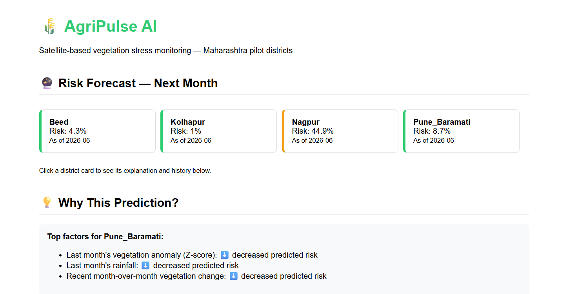

# AgriPulse-AI 🌾


**Satellite-based vegetation stress forecasting for Maharashtra agriculture using Google Earth Engine, machine learning, and explainable AI.**

## Problem Statement

Agricultural vegetation stress — from drought, poor rainfall
distribution, or heat — is usually noticed only after visible crop
damage has occurred, by which point yield loss is often already
locked in. This project asks: **can multi-source satellite time-series
data be used to forecast vegetation stress one month in advance, using
explainable machine learning?**

## Overview



AgriPulse AI is an end-to-end system that:
1. Extracts monthly vegetation, moisture, rainfall, and temperature
   data from satellite sources via Google Earth Engine
2. Computes historically-calibrated anomaly scores to identify
   vegetation stress
3. Trains a machine learning model to forecast next-month stress risk
4. Explains each prediction using SHAP (SHapley Additive exPlanations)
5. Serves predictions through a REST API and a Streamlit dashboard
6. Automates the prediction refresh on a schedule using n8n

Piloted across 4 agro-climatically distinct Maharashtra districts:
**Pune (Baramati)**, **Beed**, **Nagpur**, and **Kolhapur** — chosen to
represent a mix of irrigated, drought-prone, and wetter agricultural
conditions.

## Architecture

```
Google Earth Engine (Sentinel-2, CHIRPS, MODIS)
        │
        ▼
Python Monthly Data Pipeline (NDVI, NDMI, Rainfall, LST)
        │
        ▼
Historical Baseline & Z-Score Anomaly Detection
        │
        ▼
Feature Engineering (lagged & rolling features, no data leakage)
        │
        ▼
Random Forest Classifier (binary: Stressed / Not Stressed forecast) ◄── n8n Automation
        │                                                              (scheduled prediction
        ├─────────────────────┐                                        refresh, not retraining)
        ▼                     ▼
SHAP Explainability     FastAPI Backend (REST API)
                                │
                    ┌───────────┴───────────┐
                    ▼                       ▼
            Streamlit Dashboard      Web Frontend (HTML/JS)
```

## Tech Stack

| Layer | Tool |
|---|---|
| Satellite data | Google Earth Engine (Sentinel-2, CHIRPS, MODIS) |
| Data processing | Python, pandas |
| Machine learning | scikit-learn (Random Forest) |
| Explainability | SHAP |
| Dashboard | Streamlit, Plotly |
| Backend API | FastAPI, uvicorn |
| Frontend | HTML / JavaScript (framework-agnostic, calls the API directly) |
| Automation | n8n (self-hosted, native Windows install) |
| Version control | Git, GitHub |

## Key Results

- Built a working data pipeline across 4 districts, 2019-2026,
  extracting NDVI, NDMI, rainfall, and land surface temperature.
- Developed a data-driven vegetation stress labeling methodology
  using Z-score anomalies against each district's own historical
  monthly baseline.
- Trained a binary forecasting model (Stressed vs. Not Stressed)
  achieving 0.42 F1-score on the Stressed class, with 64% recall
  (catching roughly 2 of every 3 real stress events).
- Tested three improvement approaches (XGBoost, threshold tuning, an
  additional engineered feature) — none outperformed the baseline
  Random Forest, a finding attributed to limited training data volume
  and documented transparently in [PROJECT_LOG.md](docs/PROJECT_LOG.md).
- Added SHAP-based explainability, confirming the model relies most
  heavily on recent vegetation anomaly trends (Z-score, NDVI lag),
  consistent with the underlying hypothesis.
- Decoupled the model from the dashboard by building a FastAPI
  backend exposing forecast, explanation, and history endpoints —
  and a standalone HTML/JS frontend that consumes it independently,
  demonstrating the model can serve any frontend, not just Streamlit.
- Built and debugged a genuine working automation pipeline using
  n8n, scheduling the prediction script to run and log results
  automatically.

## System Components

### 1. Data Pipeline (`gee/`)
Google Earth Engine scripts that extract monthly NDVI, NDMI, rainfall,
and land surface temperature per district, with pixel-level cloud
masking and defensive handling of missing satellite data.

### 2. Feature Engineering & Modeling (`notebooks/`)
Python scripts computing historical baselines, Z-score anomalies,
stress state labels, lagged/rolling forecasting features, and the
trained Random Forest model, including full evaluation and SHAP
explainability.

### 3. Dashboard (`dashboard/`)
A Streamlit application showing live risk forecasts, plain-language
explanations, and color-coded NDVI trend charts per district.

Run locally:
```bash
streamlit run dashboard/app.py
```

### 4. API (`api/`)
A FastAPI backend wrapping the trained model and SHAP explainer as
REST endpoints, independent of the dashboard:

| Endpoint | Description |
|---|---|
| `GET /districts` | List all pilot districts |
| `GET /risk` | Current next-month risk forecast for all districts |
| `GET /explain/{district}` | Top SHAP factors driving a district's forecast |
| `GET /history/{district}` | Historical NDVI and stress state timeline |

Run locally:
```bash
uvicorn api.main:app --reload --port 8000
```
Interactive API docs available at `http://localhost:8000/docs`.

### 5. Frontend (`frontend/`)
A minimal HTML/JS page that consumes the API directly — click any
district card to see its risk forecast, top contributing factors, and
NDVI history table. Demonstrates the model/backend working
independently of any specific frontend framework.

Open `frontend/index.html` directly in a browser (with the API
running) to view it.

### 6. Automation (`automation/`)
An n8n workflow, running natively on Windows (via npm), that triggers
a scheduled script to reload the trained model and log current risk
levels per district. This automates the *prediction refresh* step
specifically — it does not re-run satellite data extraction or
retrain the model, which currently remain manual steps.

## Repository Structure

```
AgriPulse-AI/
│
├── api/                 # FastAPI backend
├── automation/           # n8n workflow
├── dashboard/            # Streamlit dashboard
├── data/
│   ├── processed/
│   └── raw/
├── docs/                 # Project log, plots, screenshots
├── frontend/             # HTML/JS frontend
├── gee/                  # Google Earth Engine scripts
├── models/               # Trained model artifacts
├── notebooks/            # Feature engineering & ML scripts
├── requirements.txt
├── LICENSE
└── README.md
```

## Known Limitations

- **Sample size**: only 6 years of historical baseline data per
  district; a longer record would improve statistical reliability.
- **Labeling granularity**: the original 4-class stress labeling
  (Healthy/Emerging/Persistent/Recovery) was not reliable enough to
  forecast directly at this data volume; a simplified binary framing
  was adopted instead for forecasting (see PROJECT_LOG, Week 3), while
  the 4-class labels remain useful for descriptive monitoring.
- **Automation scope**: n8n currently automates the prediction
  refresh step only (loading the trained model and logging current
  risk); it does not yet trigger satellite data extraction or model
  retraining. Full end-to-end automation is identified as future work.
- **Deployment**: the API and frontend currently run locally; public
  deployment (e.g., via a cloud host) and connecting a richer frontend
  (e.g., Lovable-generated) were scoped as future work after
  confirming a cloud-hosted frontend cannot reach a local-only backend
  without a public tunnel or deployment.
- **Geographic scope**: piloted on 4 districts; architecture is
  designed to scale to additional districts and a statewide view.

## Running This Project

**1. Data pipeline** — GEE scripts in `gee/`, run in the
[Google Earth Engine Code Editor](https://code.earthengine.google.com).

**2. Install dependencies**
```bash
pip install -r requirements.txt
```

**3. Feature engineering & model training**
```bash
python notebooks/week2_part2a_zscore.py
python notebooks/week2_part2b_labels.py
python notebooks/week11_day11_finalize_model.py
```

**4. Dashboard**
```bash
streamlit run dashboard/app.py
```

**5. API + Frontend**
```bash
uvicorn api.main:app --reload --port 8000
```
Then open `frontend/index.html` in a browser.

**6. Automation** — install n8n natively (`npm install n8n -g && n8n start`),
then import `automation/agripulse_full_automation.json` into it.

## Project Documentation

Full week-by-week build log — including every bug encountered and how
it was resolved, evidence-based methodology decisions, and honest
negative results — is available in
[docs/PROJECT_LOG.md](docs/PROJECT_LOG.md).

## License

This project is licensed under the MIT License — see [LICENSE](LICENSE) for details.

## Author

Srushti Shinde — [LinkedIn](https://linkedin.com/in/srushti-shinde-398a32326)
```

